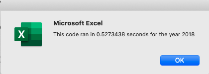

# stock-analysis
Author: Jerome Simmons

## Overview of Project
Steve wants to analyze a group of stocks for his parents. He also wants to ensure that his stock analysis is efficient and capable of analyzing a large set of tickers. For this assignment, we have refactored our originally provided code in order to more efficiently analyze the group of stocks by taking fewer code steps, using less memory, and improving the logic of the code to make it easier to read.

## Results
The refactored code was significantly more efficient and reduced analysis time by over 85%. With our original code, the VBA script took 0.5429688 and 0.5273438 seconds to analyze the 2017 and 2018 data sets respectively. The refactored code, analyzed both 2017 and 2018 stock data in 0.07421875 seconds.

### 2017 efficiency improvement (0.07421875/0.5429688-1): -86% time reduction
 
vs 

### 2018 efficiency improvement (0.07421875/0.5273438-1): -85% time reduction
 
vs 

## Summary
The refactored code is significantly (85%+) more efficient than the original code.

### What are the advantages or disadvantages of refactoring code?
There are more advantages than disadvantages to refactoring code. Although refactoring code requires additional time upfront, the refactored code saved us time running the analysis and made our code more scalable for future projects. These investments are particularly helpful if we increased 
1. the size of the data set (i.e. number of stocks)
2. the complexity of the analysis (i.e. more analytical views)
3. the complexity of the script (i.e. more scripts).

By refactoring our code, we ensure that our script is efficient, which reduces time to insight and prevents unnecessary wear and tear on our machine. If we run inefficient code, our computer is more prone to overheat, crash, etc.

### How do these pros and cons apply to refactoring the original VBA script?
Refactoring the original VBA script saved us approximately 0.4 seconds and the effort took approximately 2 hours. In this case, we would need to run the analysis approximately 18,000 times in order to justify the time investment (7,200 seconds / 0.4 seconds saved). Thus, refactoring the code did not seem worth the effort, but if we treat this code as a foundational analysis to much more complex work, then our time investment will likely prove very valuable.
